<!-- Style block -->
<style>
img[alt~="center"] {
  display: block;
  margin: 0 auto;
}
</style>


### Repository

#### Using a existing repository

If the repository already exists, we need to clone it to our local machine:


```bash
git clone <repository_URL>
```

---
#### Create a new repository 

Let's start by creating a new repository and adding some files to it.

```bash
mkdir my_project
cd my_project
git init
```

Now, let's create a new text file and add some content to it.

```bash
echo "This is a sample text file." > sample.txt
```
---

### Making Changes

Next, let's track the changes we made and commit them to the repository.

```bash
git status
```
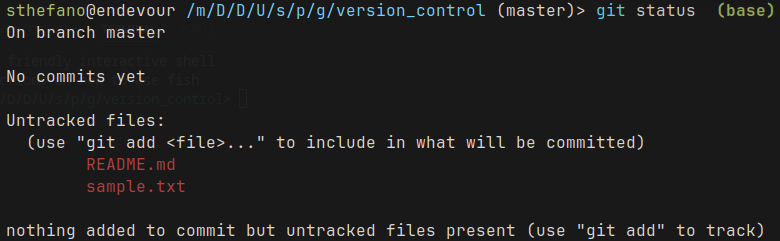

---

```bash
git add sample.txt
git commit -m "Added sample.txt"
```
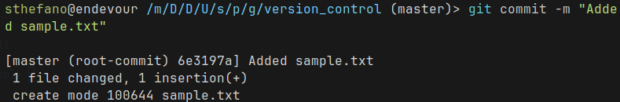


Now, let's modify the content of `sample.txt`. Note the flag `-am`, where `a` adds the tracked files for the commit.

```bash
echo "This is a modified content." >> sample.txt
git commit -am "Modified sample.txt"
```

---

### Viewing History

We can view the commit history to see our changes.

```bash
git log
```
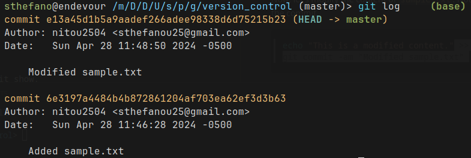

---

For a concise view:

```bash
git log --oneline
```
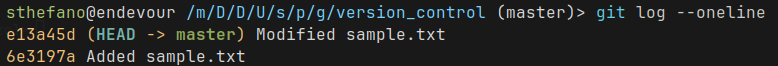

---
Displaying changes in a commit with git show.

```bash
git show <commit_hash>
```
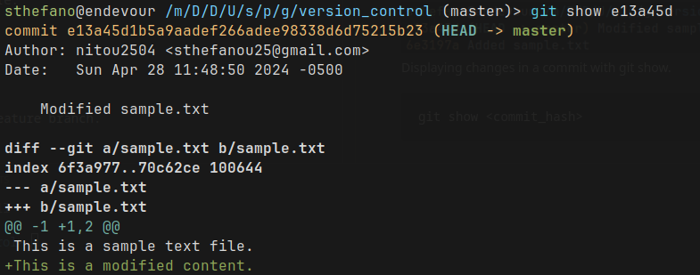

---
### Branching

Let's create a new branch for a feature.

```bash
git branch feature_branch
git checkout feature_branch
```
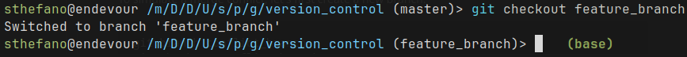

---
Now, let's make some changes in the feature branch.

```bash
echo "This is a feature branch change." >> sample.txt
git commit -am "Feature branch change in sample.txt"
```

Switch back to the main branch.

```bash
git checkout master
```
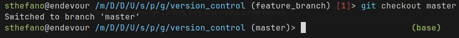

---
Merge the changes from the feature branch into the main branch.

```bash
git merge feature_branch
```

Note that the commit from the `feature_branch` is now in the `master` branch:

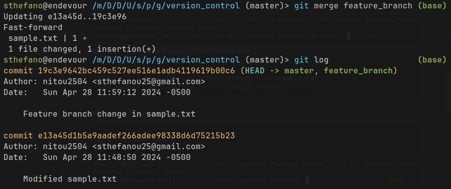

---
#### Merge Conflict

To simulate a merge conflict, let's first create a new branch.

```bash
git branch conflict_branch
git checkout conflict_branch
```

Now, let's modify `sample.txt` in the conflict branch.

```bash
echo "This is a change in the conflict branch." >> sample.txt
git commit -am "conflict change in sample.txt"
```
---


---
Switch back to the main branch.

```bash
git checkout master
```

Note that the last change in the `master` was from the previous branch merge:

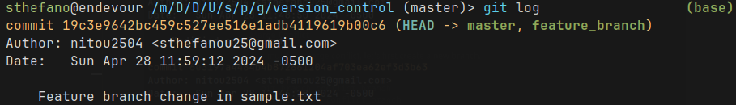

---

Now, let's modify the same line in `sample.txt` in the main branch.

```bash
echo "This is a conflicting change in the main branch." >> sample.txt
git commit -am "conflict change (master) in sample.txt"
```

Now, try to merge the conflict branch into the main branch.

```bash
git merge conflict_branch
```

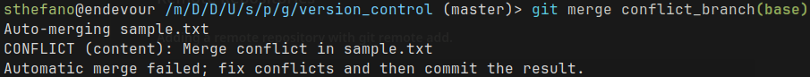

---
You'll encounter a merge conflict. You'll need to manually resolve it by editing the `sample.txt` file, removing the conflict markers, and keeping the desired changes. After resolving the conflict, add and commit the changes:

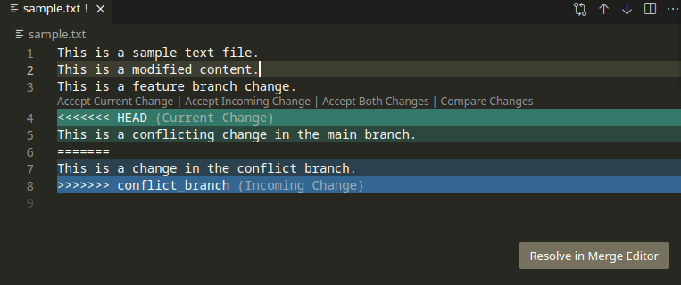

---
```bash
git add sample.txt
git commit -m "Resolve merge conflict"
```
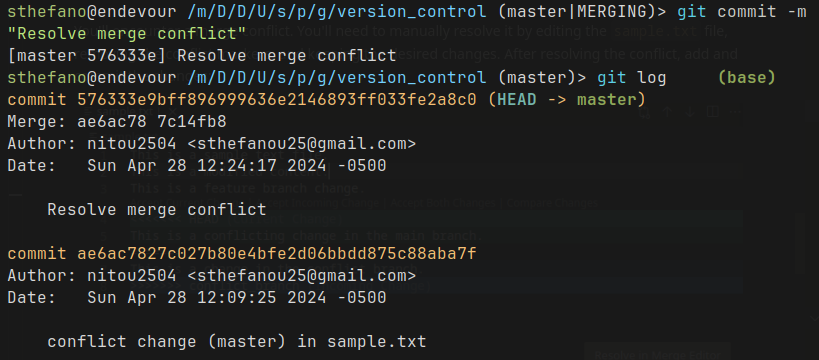

---

### Remote Repositories

#### Adding a remote repository with git remote add.

```bash
git remote add origin <repository_URL>
```

If you already have changes in your local git and want to push them to a new empty remote repo:

```bash
git push -u origin master
```
---
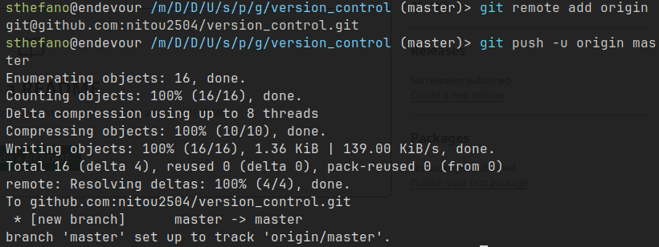


#### Pushing changes to a remote repository with git push.

```bash
git push origin <branch_name>
```

#### Pulling changes from a remote repository with git pull.

```bash
git pull origin <branch_name>
```

---
### Useful Tips and Tricks

#### Aliases for common commands.

You can set up aliases in your `~/.gitconfig` file:

```bash
git config --global alias.lg "log --oneline"
```

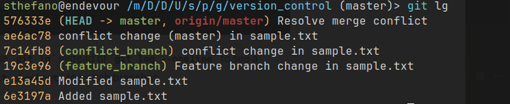

---

#### Using .gitignore to ignore files.

Create a `.gitignore` file in your repository's root directory and list the files or patterns you want to ignore. This is commonly done for binaries such as images, since they will appear on status messages:

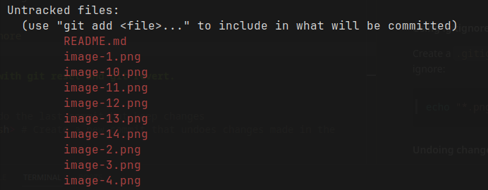

---

```bash
echo "*.png" > .gitignore
git add .gitignore
```


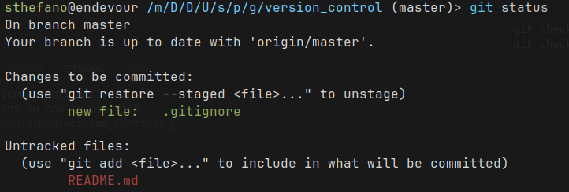

---

#### Fix last commit with `amend`

`--amend` is a useful flag to use when we make a commit but we forgot to add files or changes (or fix typos in the commit message). For example, we forgot to add the README.md in our last commit:

```bash
git commit -am "added gitignore"
```

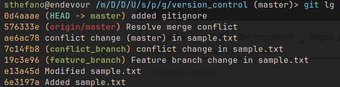

---

We need to stage the forgotten file, and ammend the commit:

```bash
git add README.md
git commit --amend -m "added gitignore and readme"
```
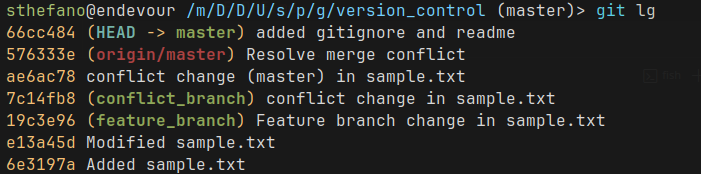

Thus, our last commit was fixed.

---

#### Jumping between old and current versions with checkout `<commit>` and checkout `<HEAD>`.

```bash
git checkout <commit_hash> # To switch to an old commit
git checkout <branch_name> # To switch back to the current branch
```
