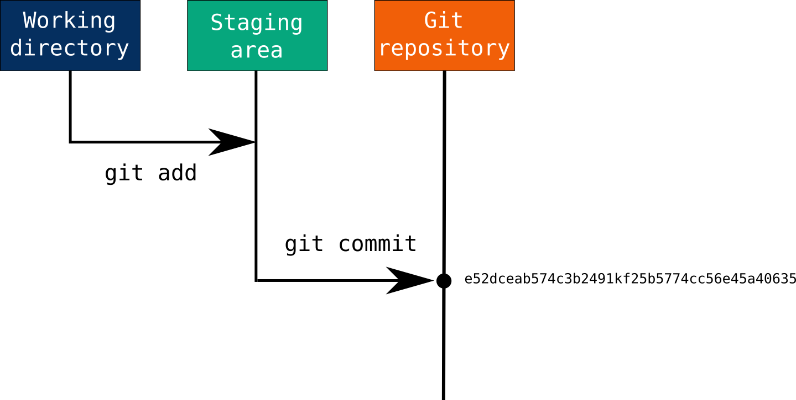

<!-- Style block -->
<style>
img[alt~="center"] {
  display: block;
  margin: 0 auto;
}
</style>

##### GRUPO 5

## USO DE HERRAMIENTAS DE CONTROL DE VERSIONES

 Martina Vásconez, Sthefano Ulloa, Gabriela Coloma


---

### Control de versiones
#### ¿Qué es?

Es una herramienta en el desarrollo del software que te permite registrar cambios en tu archivo a lo largo del tiempo


---
### Categorías principales
#### Centralizado

Existe un único repositorio central que almacena toda el proyecto


---
#### Distribuido

Cada usuario tiene su propio repositorio local en donde pueden trabajar de forma independiente


---

### Dos etapas
#### Working 
El directorio de trabajo es donde realizas todas las modificaciones a tus archivos

#### Staging
El área de preparación, también conocida como "índice", es un área intermedia donde se registran los cambios antes de confirmarlos realmente en la historia del proyecto

---
### Funciones

#### Seguimiento de cambios

Listado en el que se guarda qué usuario ha modificado en el documento

#### Historial de versiones

Almacena todas las versiones del documento y puedes regresar a cualquiera

---

#### Notificación de cambios

Avisa a los usuarios sobre cualquier modificación que se haya hecho. 

#### Comparación de documentos

Permite detectar qué ha sido cambiado de una versión a otra, línea por línea.


#### Experimentar

Pueden sacar una sección del documento para modificar algo y probar si sirve. Lo puedes guardar o simplemente dejar la versión anterior.

---

### Repositorio 
Un repositorio en Git es un lugar donde se almacenan todos los archivos y carpetas de un proyecto, junto con el historial completo de cambios realizados en esos archivos a lo largo del tiempo. Es como una base de datos que registra todas las modificaciones realizadas en el código fuente de un proyecto.


---
#### Utilizando un repositorio existente

Si el repositorio ya existe, necesitamos clonarlo en nuestra máquina local:


```bash
git clone <URL_del_repositorio>
```

---
#### Crear un nuevo repositorio 

Comencemos creando un nuevo repositorio y agregando algunos archivos a él.

```bash
mkdir my_project
cd my_project
git init
```

Ahora, creemos un nuevo archivo de texto y agreguemos algo de contenido.

```bash
echo "This is a sample text file." > sample.txt
```
---

### Realizando Cambios
Al realizar cambios en los archivos de un repositorio, es importante seguir ciertos pasos para registrar y confirmar esos cambios de manera adecuada. Estos pasos aseguran que los cambios se registren correctamente en el historial del repositorio.



---

A continuación, hagamos un seguimiento de los cambios que hicimos y los confirmemos en el repositorio.

```bash
git status
```


---

```bash
git add sample.txt
git commit -m "Added sample.txt"
```


Ahora, modifiquemos el contenido de `sample.txt`. Observa la bandera `-am`, donde `a` agrega los archivos trackeados para el commit.

```bash
echo "This is a modified content." >> sample.txt
git commit -am "Modified sample.txt"
```

---

### Visualización del Historial

El historial de un repositorio muestra todos los commits realizados, junto con información sobre quién hizo cada cambio, qué se cambió y cuándo se realizó. Esto permite a los desarrolladores revisar el progreso del proyecto a lo largo del tiempo y entender cómo ha evolucionado el código fuente.


---
Podemos ver el historial de commits para ver nuestros cambios.

```bash
git log
```


---

Para una vista concisa:

```bash
git log --oneline
```


---
Mostrando cambios en un commit con git show.

```bash
git show <commit_hash>
```


---
### Branching

Las ramas en Git permiten a los desarrolladores trabajar en nuevas características o experimentos sin afectar el código principal del proyecto. Cada rama representa una línea independiente de desarrollo y puede contener diferentes conjuntos de cambios. Las ramas se utilizan para organizar el trabajo y facilitar la colaboración entre varios miembros del equipo.


---

Creemos una nueva rama para una característica nueva.

```bash
git branch feature_branch
git checkout feature_branch
```


---
Ahora, hagamos algunos cambios en la rama de la característica.

```bash
echo "This is a feature branch change." >> sample.txt
git commit -am "Feature branch change in sample.txt"
```

Cambiemos de nuevo a la rama principal.

```bash
git checkout master
```


---
Fusionemos los cambios de la rama de la característica en la rama principal.

```bash
git merge feature_branch
```

Observa que el commit de la `feature_branch` ahora está en la rama `master`:


---
#### Conflicto de Merge


Un conflicto de fusión ocurre cuando Git no puede combinar automáticamente los cambios de dos ramas debido a modificaciones conflictivas en el mismo archivo o línea de código. Es necesario resolver el conflicto manualmente editando el archivo afectado y eligiendo qué cambios mantener. Una vez resuelto el conflicto, se pueden agregar los cambios y confirmar la fusión.


---

Para simular un conflicto de fusión, primero creemos una nueva rama.

```bash
git branch conflict_branch
git checkout conflict_branch
```

Ahora, modifiquemos `sample.txt` en la rama de conflicto.

```bash
echo "This is a change in the conflict branch." >> sample.txt
git commit -am "conflict change in sample.txt"
```
---


---
Cambiamos de nuevo a la rama principal.

```bash
git checkout master
```

Observa que el último cambio en `master` fue de la fusión de la rama anterior:


---

Ahora

, modifiquemos la misma línea en `sample.txt` en la rama principal.

```bash
echo "This is a conflicting change in the main branch." >> sample.txt
git commit -am "conflict change (master) in sample.txt"
```

Ahora, intenta fusionar la rama de conflicto en la rama principal.

```bash
git merge conflict_branch
```


---
Encontrarás un conflicto de fusión. Deberás resolverlo manualmente editando el archivo `muestra.txt`, eliminando los marcadores de conflicto y conservando los cambios deseados. Después de resolver el conflicto, agrega y confirma los cambios:


---
```bash
git add sample.txt
git commit -m "Resolve merge conflict"
```


---

### Repositorios Remotos

Los repositorios remotos en Git son versiones de un proyecto alojadas en servidores en línea, como GitHub o GitLab. Estos repositorios permiten a los desarrolladores colaborar en un proyecto compartiendo sus cambios de forma remota. 


---

#### Agregar un repositorio remoto con git remote add.

```bash
git remote add origin <URL_del_repositorio>
```

Si ya tienes cambios en tu git local y quieres enviarlos a un nuevo repositorio remoto vacío:

```bash
git push -u origin master
```
---


#### Enviar cambios a un repositorio remoto con git push.

```bash
git push origin <nombre_rama>
```

#### Traer cambios de un repositorio remoto con git pull.

```bash
git pull origin <nombre_rama>
```

---
### Consejos y Trucos Útiles

#### Alias para comandos comunes.

Puedes configurar aliases en tu archivo `~/.gitconfig`:

```bash
git config --global alias.lg "log --oneline"
```


---

#### Usar .gitignore para ignorar archivos.

Crea un archivo `.gitignore` en el directorio raíz de tu repositorio y enumera los archivos o patrones que deseas ignorar. Esto se hace comúnmente para binarios como imágenes, ya que aparecerán en los mensajes de estado:


---

```bash
echo "*.png" > .gitignore
git add .gitignore
```


---

#### Arreglar el último commit con `amend`

`--amend` es una bandera útil para usar cuando hacemos un commit pero olvidamos agregar archivos o cambios (o corregir errores tipográficos en el mensaje de commit). Por ejemplo, olvidamos agregar el README.md en nuestro último commit:

```bash
git commit -am "added gitignore"
```


---

Necesitamos preparar el archivo olvidado (agregarlo al staging) y enmendar el commit:

```bash
git add README.md
git commit --amend -m "added gitignore and readme"
```


Así, nuestro último commit fue corregido.

---

#### Saltar entre versiones antiguas y actuales con checkout `<hash_del_commit>` y checkout `<nombre_rama>`.

```bash
git checkout <hash_del_commit> # Para cambiar a un commit antiguo
git checkout <nombre_rama> # Para cambiar de nuevo a la rama actual
```
