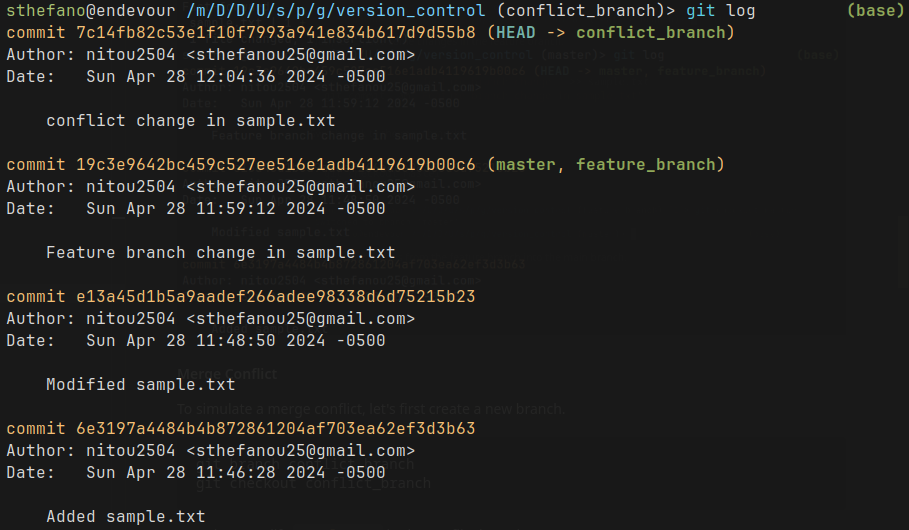

<!-- Style block -->
<style>
img[alt~="center"] {
  display: block;
  margin: 0 auto;
}
</style>

##### GRUPO 5

## USO DE HERRAMIENTAS DE CONTROL DE VERSIONES

 Martina Vásconez, Sthefano Ulloa, Gabriela Coloma


---

## Control de versiones
#### ¿Qué es?

Es una herramienta en el desarrollo del software que te permite registrar cambios en tu archivo a lo largo del tiempo


---
## Categorías principales
#### Centralizado

Existe un único repositorio central que almacena toda el proyecto


---
#### Distribuido

Cada usuario tiene su propio repositorio local en donde pueden trabajar de forma independiente


---

## Dos etapas
#### Working 
El directorio de trabajo es donde realizas todas las modificaciones a tus archivos

#### Staging
El área de preparación, también conocida como "índice", es un área intermedia donde se registran los cambios antes de confirmarlos realmente en la historia del proyecto

---
## Funciones

#### Seguimiento de cambios

Listado en el que se guarda que usuario ha modificado en el documento

#### Historial de versiones

Almacena todas las versiones del documento y puedes regresar a cualquiera

---

#### Notificación de cambios

Avisa a los usuarios sobre cualquier modificación que se haya hecho. 

#### Comparación de documentos

Permite detectar que ha sido cambiado de una versión a otra, línea por línea.


#### Experimentar

Pueden sacar una sección del documento para modificar algo y probar si sirve. Lo puedes guardar o simplemente dejar la anterior versión.

---

### Repository 
Un repositorio en Git es un lugar donde se almacenan todos los archivos y carpetas de un proyecto, junto con el historial completo de cambios realizados en esos archivos a lo largo del tiempo. Es como una base de datos que registra todas las modificaciones realizadas en el código fuente de un proyecto.


---
#### Using a existing repository

If the repository already exists, we need to clone it to our local machine:


```bash
git clone <repository_URL>
```

---
#### Create a new repository 

Let's start by creating a new repository and adding some files to it.

```bash
mkdir my_project
cd my_project
git init
```

Now, let's create a new text file and add some content to it.

```bash
echo "This is a sample text file." > sample.txt
```
---

### Making Changes
Al realizar cambios en los archivos de un repositorio, es importante seguir ciertos pasos para registrar y confirmar esos cambios de manera adecuada. Estos pasos aseguran que los cambios se registren correctamente en el historial del repositorio.


---

Next, let's track the changes we made and commit them to the repository.

```bash
git status
```


---

```bash
git add sample.txt
git commit -m "Added sample.txt"
```


Now, let's modify the content of `sample.txt`. Note the flag `-am`, where `a` adds the tracked files for the commit.

```bash
echo "This is a modified content." >> sample.txt
git commit -am "Modified sample.txt"
```

---

### Viewing History

El historial de un repositorio muestra todos los commits realizados, junto con información sobre quién hizo cada cambio, qué se cambió y cuándo se realizó. Esto permite a los desarrolladores revisar el progreso del proyecto a lo largo del tiempo y entender cómo ha evolucionado el código fuente.


---
We can view the commit history to see our changes.

```bash
git log
```


---

For a concise view:

```bash
git log --oneline
```


---
Displaying changes in a commit with git show.

```bash
git show <commit_hash>
```


---
### Branching

Las ramas en Git permiten a los desarrolladores trabajar en nuevas características o experimentos sin afectar el código principal del proyecto. Cada rama representa una línea independiente de desarrollo y puede contener diferentes conjuntos de cambios. Las ramas se utilizan para organizar el trabajo y facilitar la colaboración entre varios miembros del equipo.


---

Let's create a new branch for a feature.

```bash
git branch feature_branch
git checkout feature_branch
```


---
Now, let's make some changes in the feature branch.

```bash
echo "This is a feature branch change." >> sample.txt
git commit -am "Feature branch change in sample.txt"
```

Switch back to the main branch.

```bash
git checkout master
```


---
Merge the changes from the feature branch into the main branch.

```bash
git merge feature_branch
```

Note that the commit from the `feature_branch` is now in the `master` branch:


---
#### Merge Conflict


Un merge conflict ocurre cuando Git no puede combinar automáticamente los cambios de dos ramas debido a modificaciones conflictivas en el mismo archivo o línea de código. Es necesario resolver el conflicto manualmente editando el archivo afectado y eligiendo qué cambios mantener. Una vez resuelto el conflicto, se pueden agregar los cambios y confirmar la fusión.


---

To simulate a merge conflict, let's first create a new branch.

```bash
git branch conflict_branch
git checkout conflict_branch
```

Now, let's modify `sample.txt` in the conflict branch.

```bash
echo "This is a change in the conflict branch." >> sample.txt
git commit -am "conflict change in sample.txt"
```
---


---
Switch back to the main branch.

```bash
git checkout master
```

Note that the last change in the `master` was from the previous branch merge:


---

Now, let's modify the same line in `sample.txt` in the main branch.

```bash
echo "This is a conflicting change in the main branch." >> sample.txt
git commit -am "conflict change (master) in sample.txt"
```

Now, try to merge the conflict branch into the main branch.

```bash
git merge conflict_branch
```


---
You'll encounter a merge conflict. You'll need to manually resolve it by editing the `sample.txt` file, removing the conflict markers, and keeping the desired changes. After resolving the conflict, add and commit the changes:


---
```bash
git add sample.txt
git commit -m "Resolve merge conflict"
```


---

### Remote Repositories

Los repositorios remotos en Git son versiones de un proyecto alojadas en servidores en línea, como GitHub o GitLab. Estos repositorios permiten a los desarrolladores colaborar en un proyecto compartiendo sus cambios de forma remota. 


---

#### Adding a remote repository with git remote add.

```bash
git remote add origin <repository_URL>
```

If you already have changes in your local git and want to push them to a new empty remote repo:

```bash
git push -u origin master
```
---


#### Pushing changes to a remote repository with git push.

```bash
git push origin <branch_name>
```

#### Pulling changes from a remote repository with git pull.

```bash
git pull origin <branch_name>
```

---
### Useful Tips and Tricks

#### Aliases for common commands.

You can set up aliases in your `~/.gitconfig` file:

```bash
git config --global alias.lg "log --oneline"
```


---

#### Using .gitignore to ignore files.

Create a `.gitignore` file in your repository's root directory and list the files or patterns you want to ignore. This is commonly done for binaries such as images, since they will appear on status messages:


---

```bash
echo "*.png" > .gitignore
git add .gitignore
```


---

#### Fix last commit with `amend`

`--amend` is a useful flag to use when we make a commit but we forgot to add files or changes (or fix typos in the commit message). For example, we forgot to add the README.md in our last commit:

```bash
git commit -am "added gitignore"
```


---

We need to stage the forgotten file, and ammend the commit:

```bash
git add README.md
git commit --amend -m "added gitignore and readme"
```


Thus, our last commit was fixed.

---

#### Jumping between old and current versions with checkout `<commit>` and checkout `<HEAD>`.

```bash
git checkout <commit_hash> # To switch to an old commit
git checkout <branch_name> # To switch back to the current branch
```
